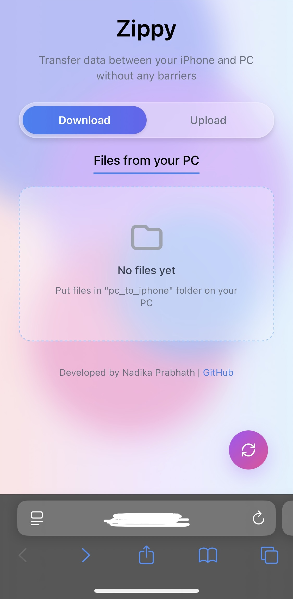
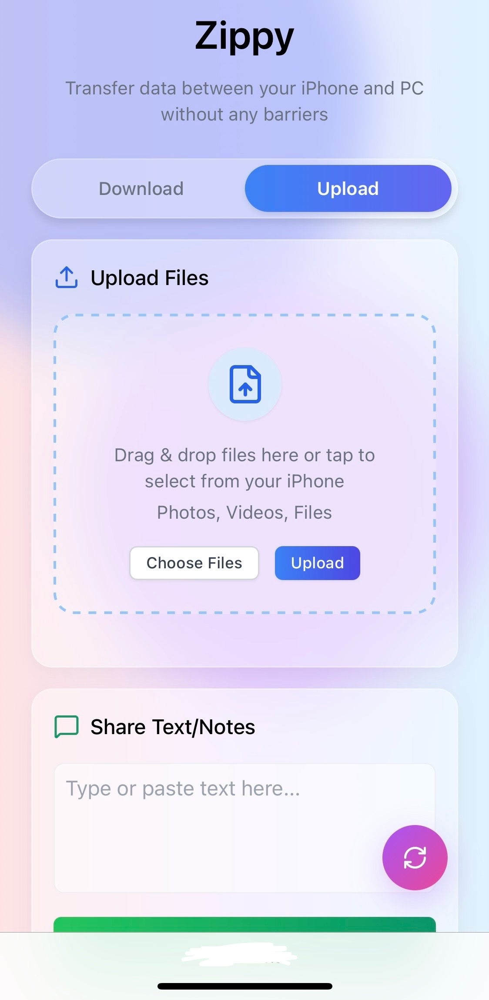
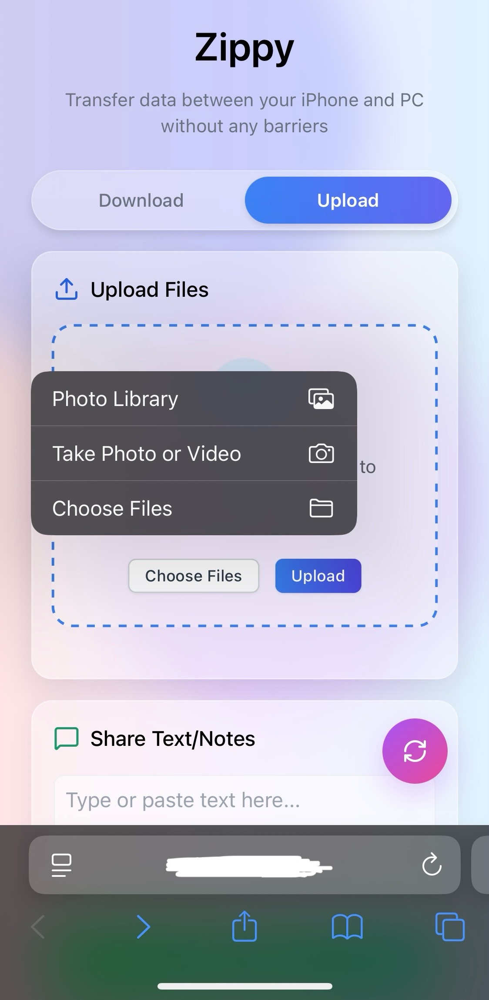
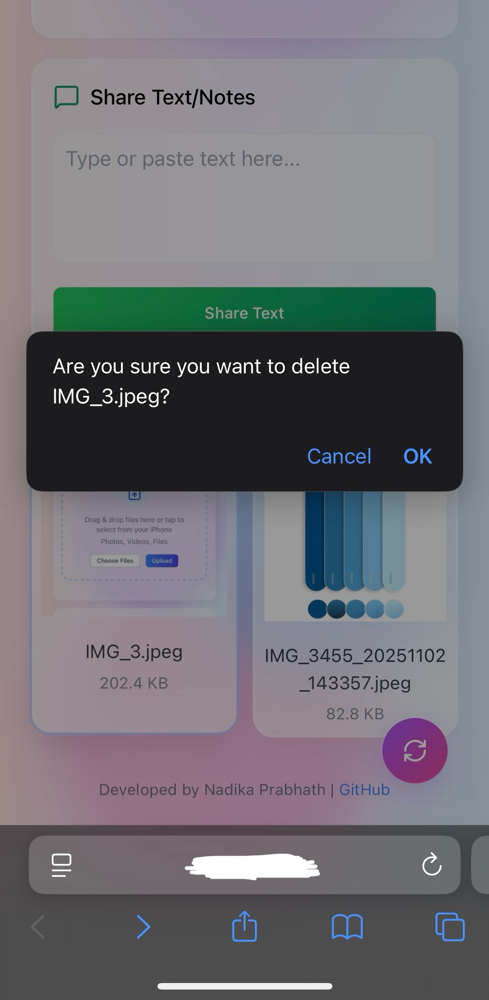

# Zippy

<div align="center">


**Enterprise-grade local file transfer solution for PC and iPhone**

[Installation](#installation) • [Usage](#usage) • [Features](#features) • [API](#api-reference) • [Contributing](#contributing)

</div>

---

## Overview

Zippy is a sophisticated Flask-based web application that enables seamless, bidirectional file transfer between PC and iPhone devices over a local network. Built with modern web technologies and real-time communication protocols, Zippy provides a professional-grade solution for cross-platform file sharing without relying on cloud services or external dependencies.

### Key Capabilities

- **Bidirectional Transfer**: Full-duplex file transfer supporting PC→iPhone and iPhone→PC workflows
- **Real-time Synchronization**: WebSocket-based live updates using Socket.IO for instant file notifications
- **Multi-format Support**: Comprehensive file type handling including images (JPG, PNG, GIF, HEIC), videos (MP4, MOV, AVI), audio (MP3, WAV, M4A), documents (PDF, DOC, DOCX), and archives (ZIP, RAR)
- **Progressive Upload**: Chunked file upload with real-time progress tracking and bandwidth optimization
- **Enterprise UI/UX**: Responsive glassmorphism interface built with TailwindCSS, optimized for mobile-first design
- **Zero-Configuration Discovery**: Automatic file system monitoring with watchdog integration
- **Secure Handling**: Werkzeug-based filename sanitization and MIME type validation

## Architecture

```
┌─────────────────┐         WebSocket         ┌──────────────────┐
│                 │◄─────────────────────────►│                  │
│   iPhone/iPad   │      HTTP/REST API        │   Flask Server   │
│   (Safari)      │◄─────────────────────────►│   (Python 3.7+)  │
│                 │                           │                  │
└─────────────────┘                           └──────────────────┘
                                                        │
                                                        │
                                               ┌────────▼─────────┐
                                               │  File System     │
                                               │  ┌─────────────┐ │
                                               │  │pc_to_iphone │ │
                                               │  └─────────────┘ │
                                               │  ┌─────────────┐ │
                                               │  │iphone_to_pc │ │
                                               │  └─────────────┘ │
                                               └──────────────────┘
```
## Images

<p align="center">
  
  
  
  
</p>

## Installation

### Prerequisites

- Python 3.7 or higher [python.org](https://www.python.org/downloads/)
- pip package manager
- Local network connectivity (WiFi/Ethernet)

### Setup

```bash
# Clone the repository
git clone https://github.com/nadikaprabhath/zippy.git
cd zippy

# Install dependencies
pip install flask flask-socketio watchdog

# Launch the server
python app.py
```

The server will start on `http://0.0.0.0:5000` and automatically:
- Create required directories (`pc_to_iphone/`, `iphone_to_pc/`)
- Initialize file system monitoring
- Start WebSocket server for real-time updates

### Network Configuration

1. Determine your PC's local IP address:
   ```bash
   # Windows
   ipconfig
   
   # macOS/Linux
   ifconfig
   ```

2. Connect your iPhone to the same network as your PC

3. Access the web interface from Safari:
   ```
   http://YOUR_PC_IP:5000
   ```

## Usage

### PC to iPhone Transfer

1. **Direct File Drop**
   - Place files in the `pc_to_iphone/` directory
   - Files are automatically detected via file system monitoring
   - Real-time notification pushed to connected clients

2. **Web Interface Download**
   - Navigate to the "Download" tab on your iPhone
   - Tap any file to initiate download
   - Automatic MIME type detection for proper file handling

### iPhone to PC Transfer

1. **File Upload**
   - Access the "Upload" tab
   - Use drag-and-drop or file picker
   - Monitor real-time progress bars
   - Files saved to `iphone_to_pc/` with timestamp suffix

2. **Text/Note Transfer**
   - Paste or type content in text area
   - Click "Share Text" button
   - Saved as timestamped `.txt` file on PC

### File Management

- **Delete**: Hover over file card, click delete button (×)
- **Refresh**: Click floating refresh button (bottom-right)
- **Auto-refresh**: Automatic polling every 5 seconds

## Features

### Technical Features

| Feature | Implementation |
|---------|----------------|
| Real-time Updates | Socket.IO WebSocket connection with event emitters |
| File Monitoring | Watchdog observer pattern with event handlers |
| Progress Tracking | XHR upload progress events with visual indicators |
| Security | Werkzeug `secure_filename()` sanitization |
| MIME Detection | Python `mimetypes` module integration |
| Responsive Design | TailwindCSS utility-first framework |
| File Validation | Extension whitelist with configurable filters |

### User Experience

- **Glassmorphism UI**: Modern backdrop-filter effects with animated gradients
- **Drag & Drop**: Native HTML5 drag-and-drop API integration
- **Mobile Optimized**: Viewport-fit cover with touch-action optimization
- **Live Notifications**: Status messages with auto-dismiss timers
- **Image Previews**: Thumbnail generation for visual file types
- **Smart Sorting**: Most recent files first with timestamp ordering

## API Reference

### REST Endpoints

#### `GET /api/files/<source>`
List all files from specified source directory.

**Parameters:**
- `source` (string): Either `"pc"` or `"iphone"`

**Response:**
```json
[
  {
    "name": "example.jpg",
    "size": 1048576,
    "modified": 1704067200.0
  }
]
```

#### `GET /download/<source>/<filename>`
Download a specific file.

**Parameters:**
- `source` (string): Directory source
- `filename` (string): URL-encoded filename

**Response:** Binary file stream with appropriate Content-Type header

#### `POST /upload`
Upload multiple files from iPhone to PC.

**Request:** `multipart/form-data` with `files` field

**Response:** `200 OK` with upload count

#### `POST /upload/text`
Upload text content as .txt file.

**Request:** Plain text in request body

**Response:** `200 OK` with filename

#### `DELETE /delete/<source>/<filename>`
Delete a file from the server.

**Parameters:**
- `source` (string): Directory source
- `filename` (string): URL-encoded filename

**Response:** `200 OK` on success

### WebSocket Events

#### `new_file`
Emitted when new file is detected.

**Payload:**
```json
{
  "folder": "pc" | "iphone"
}
```

## Configuration

### Allowed File Extensions

Modify the `ALLOWED_EXTENSIONS` set in `app.py`:

```python
ALLOWED_EXTENSIONS = {
    'txt', 'pdf', 'png', 'jpg', 'jpeg', 'gif', 'heic',
    'mp4', 'mov', 'avi', 'mp3', 'wav', 'm4a',
    'doc', 'docx', 'zip', 'rar'
}
```

### Port Configuration

Change the default port (5000) in the server startup:

```python
socketio.run(app, host='0.0.0.0', port=YOUR_PORT, debug=True)
```

### Auto-refresh Interval

Adjust the polling interval (default: 5000ms):

```javascript
setInterval(loadAllFiles, 5000); // milliseconds
```

## Security Considerations

- **Local Network Only**: Server binds to all interfaces but should be behind firewall
- **No Authentication**: Suitable for trusted local networks only
- **Filename Sanitization**: Werkzeug secure_filename prevents path traversal
- **Extension Whitelist**: Prevents execution of arbitrary file types
- **No Cloud Storage**: All data remains on local network

### Production Deployment

For production use, implement:
- HTTPS/TLS encryption
- Authentication middleware (e.g., Flask-Login)
- Rate limiting (e.g., Flask-Limiter)
- CORS configuration for specific origins
- Input validation and sanitization

## Troubleshooting

### Connection Issues

**Symptom**: Cannot access from iPhone

**Solutions:**
- Verify both devices on same WiFi network
- Check PC firewall allows port 5000
- Disable VPN on both devices
- Try PC's hostname instead of IP

### File Upload Failures

**Symptom**: Upload progress stalls or fails

**Solutions:**
- Check disk space on PC
- Verify file size within limits
- Ensure stable WiFi connection
- Check file extension is in whitelist

### Real-time Updates Not Working

**Symptom**: Files don't appear without manual refresh

**Solutions:**
- Check browser console for WebSocket errors
- Verify Socket.IO CDN is accessible
- Restart Flask application
- Clear browser cache

## Performance Optimization

- **Chunked Uploads**: Files split into chunks for better memory handling
- **Lazy Loading**: Images load on-demand with error fallbacks
- **Debounced Events**: File system changes debounced to prevent spam
- **Progressive Rendering**: File grid renders incrementally
- **Hardware Acceleration**: CSS transforms use GPU acceleration

## Browser Compatibility

| Browser | Version | Status |
|---------|---------|--------|
| Safari (iOS) | 14+ | ✅ Fully Supported |
| Chrome (iOS) | Latest | ✅ Fully Supported |
| Firefox (iOS) | Latest | ✅ Fully Supported |
| Edge (iOS) | Latest | ✅ Fully Supported |

## System Requirements

### Server (PC)
- **OS**: Windows 10+, macOS 10.14+, Linux (any modern distro)
- **Python**: 3.7 - 3.12
- **RAM**: 256MB minimum
- **Storage**: 100MB + space for transferred files
- **Network**: WiFi or Ethernet with IPv4

### Client (iPhone)
- **iOS**: 14.0 or later
- **Browser**: Safari, Chrome, Firefox, or Edge
- **Network**: WiFi connection

## About

Zippy was developed to solve the persistent challenge of efficient file transfer between iOS devices and PCs without relying on cloud intermediaries or complex setup procedures. The project emphasizes:

- **Privacy**: All transfers occur locally on your network
- **Simplicity**: Zero-configuration for end users
- **Performance**: Optimized for large file transfers with progress tracking
- **Reliability**: Built on proven technologies (Flask, Socket.IO, Watchdog)

The codebase follows modern Python best practices with clean separation of concerns, RESTful API design, and responsive frontend architecture. Zippy is ideal for developers, content creators, and anyone who frequently transfers files between iOS and desktop environments.

## Contributing

Fork the repo, make changes, and submit a pull request. Issues welcome at [github.com/nadikaprabhath/zippy](https://github.com/nadikaprabhath/zippy-seamless-file-transfer-between-pc-and-iphone.git).

**Development Setup:**
```bash
# Clone your fork
git clone https://github.com/YOUR_USERNAME/zippy.git

# Create feature branch
git checkout -b feature/your-feature-name

# Make changes and commit
git commit -m "Add: your feature description"

# Push to your fork
git push origin feature/your-feature-name

# Open pull request on GitHub
```

**Code Style:**
- Follow PEP 8 for Python code
- Use meaningful variable names
- Add comments for complex logic
- Test changes before submitting

## License

MIT License. Copyright (c) 2025 Nadika Prabhath. See script header for details.
